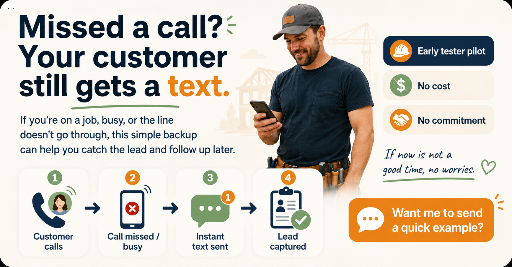

# Swoop Outreach Playbook

Reusable outreach templates for local service businesses.

## Graphic Preview (save once, reuse always)
1. Save the approved graphic file to: `public/images/outreach-missed-call.png`
2. Keep this embed block in place for quick preview:

## Core Positioning
- Problem: Missed calls turn into lost jobs.
- Outcome: Customer still gets a text, owner gets lead details for follow-up.
- Risk removal: Early tester pilot, no cost, no commitment, easy to pause.

## Personalization Tokens (for copy/paste)
- `[FirstName]` -> person name (example: Maria)
- `[Trade]` -> business type (example: plumbing, HVAC, electrical)
- `[Issue]` -> pain they mentioned (example: missed calls, busy line, after-hours calls)
- `[YourName]` -> your name
- `[OptionalContext]` -> where you saw them (example: your FB post, your comment in the local group)

## Dan Version (Already Sent, Keep As-Is)

## First Message (Low-Pressure DM)
Hi Dan, sharing this in case it helps while your line issues are getting fixed. I built a simple missed-call backup for local service businesses. If a call is missed or busy, the customer still gets a text and you get the lead for follow-up. We can run it as an early tester pilot at no cost, no commitment, and you can turn it off anytime. If now is not a good time, no worries.

## Short First-Touch Version
Hi Dan, saw your post and wanted to share something practical: a simple missed-call backup so customers still get a text and you do not lose the lead. Happy to show a quick example. No cost pilot, no commitment, and easy to turn off anytime.

## Message When Sending the Graphic
Sharing this visual in case it is useful. This is the exact flow: missed/busy call -> instant text -> lead captured for follow-up. If you want, we can run a no-cost pilot and pause it anytime.

## FB Comment + DM Sequence (Copy/Paste Workflow)
### Step 1: Public FB Comment (Helpful, low-pressure)
Dan, sorry you are dealing with this. I built a simple missed-call backup for local service businesses so customers still get a text response and leads do not fall through the cracks. Happy to share details if useful.

### Step 2: Private DM (Send after comment)
Hi Dan, saw your post and wanted to share something practical. I built a simple missed-call backup for local service businesses. If a call is missed or busy, the customer still gets a text and you get the lead for follow-up. We can run it as an early tester pilot at no cost, no commitment, and you can turn it off anytime. If now is not a good time, no worries.

### Step 3: If They Reply "Interested"
Great, happy to keep this simple. I can do a quick 10-minute walkthrough and set up a small pilot first. No commitment, and you can turn it off anytime.

### Step 4: If They Reply "Maybe Later"
Totally understand. I will leave this with you. If call issues continue, I can spin up a short pilot quickly and you can pause anytime.

### Optional Follow-Up Asset
Send the outreach graphic after they show interest, with this line:
Sharing this visual in case it helps. This is the exact flow: missed/busy call -> instant text -> lead captured for follow-up.

### Recommended Cadence
1. Day 0: Public comment + DM
2. Day 2: Soft bump (one sentence)
3. Day 5: Final close-the-loop note

## If They Reply "Interested"
Great, happy to keep this simple. I can do a quick 10-minute walkthrough and set up a small pilot first. No commitment, and you can turn it off anytime.

## If They Reply "Maybe Later"
Totally understand. I will leave this with you. If call issues continue, I can spin up a short pilot quickly and you can pause anytime.

## If They Ask "How Does It Work?"
It is a missed-call safety net. When a call is missed or busy, the customer gets an immediate text and the lead is captured so you can follow up fast.

## If They Ask About Qualification
It can handle a short back-and-forth so you can quickly understand job type, urgency, and best callback details before you call.

## Generic Templates (Future Leads)
### First DM (Low-Pressure)
Hi [FirstName], sharing this in case it helps. I built a simple missed-call backup for local [Trade] businesses. If a call is missed or busy, the customer still gets a text and you get the lead for follow-up. We can run a short early-tester pilot at no cost, no commitment, and you can turn it off anytime. If now is not a good time, no worries.

### Short First-Touch
Hi [FirstName], saw your note about [Issue] and wanted to share something practical: a simple missed-call backup so customers still get a text and you do not lose the lead. Happy to send a quick example. No cost pilot, no commitment, and easy to turn off anytime.

### Public Comment (Helpful, Not Salesy)
[FirstName], sorry you are dealing with [Issue]. I built a simple missed-call backup for local [Trade] businesses so customers still get a text response and leads do not fall through the cracks. Happy to share details if useful.

### Private DM After Comment
Hi [FirstName], saw your post and wanted to share something practical. I built a simple missed-call backup for local [Trade] businesses. If a call is missed or busy, the customer still gets a text and you get the lead for follow-up. We can run a short pilot at no cost, no commitment, and you can turn it off anytime. If now is not a good time, no worries.

### If They Reply "Interested"
Great, happy to keep this simple. I can do a quick 10-minute walkthrough and set up a small pilot first. No commitment, and you can turn it off anytime.

### If They Reply "Maybe Later"
Totally understand. I will leave this with you. If [Issue] continues, I can spin up a short pilot quickly and you can pause anytime.

### If They Ask "How Does It Work?"
It is a missed-call safety net. When a call is missed or busy, the customer gets an immediate text and the lead is captured so you can follow up fast.

### If They Ask About Pricing
For early testers, it is a no-cost pilot so you can see if it helps before committing to anything.

### One-Line Soft Bump (Day 2)
Hi [FirstName], quick bump in case this helps with [Issue]. Happy to send a 1-minute example.

### Final Close-the-Loop (Day 5)
Closing the loop here, [FirstName]. If you want to test a no-pressure pilot later, I can set it up quickly.

## FB Group Post Templates (Early Testers)
### Version 1: Early Tester Post
Hi everyone, I am looking for a few local service businesses to try something I built.

It is a simple missed-call backup: if you miss a call or your line is busy, the customer still gets a text right away, and you still get the lead details to follow up.

I am looking for early testers right now:
- no cost
- no commitment
- no risk
- easy to turn off anytime

If you run a [Trade] business and want to test it, comment "interested" or DM me.

### Version 2: Question-Style Post
Quick question for local [Trade] owners:

Have you ever been on a job, missed a call, and then never heard back from that customer?

I built a simple backup for that exact problem.
If a call is missed or busy, the customer still gets a text and you still get the lead info for follow-up.

I am looking for a small group of early testers:
- no cost
- no commitment
- can stop anytime

If you want to try it, comment here or send me a DM.

### Version 3: Short Group Post
Looking for a few early testers (local service businesses).
I built a missed-call text-back backup so missed or busy calls still get an instant text and lead capture.
No cost, no commitment, no risk, easy to turn off anytime.
Comment "interested" or DM me.

### Version 4: Any Small Business (Broad)
Hi everyone, I am looking for a few local small businesses to test a simple missed-call backup.

If a customer calls and you miss it (or your line is busy), they still get a text right away and you still capture their details so you can follow up.

This early tester phase is:
- no cost
- no commitment
- no risk
- easy to turn off anytime

If this could help your business, comment "interested" or DM me.

### Version 5: Any Small Business (Short)
Looking for a few local small businesses to test a missed-call text-back backup.
Missed or busy calls still get an instant text and lead capture.
No cost, no commitment, no risk, easy to turn off anytime.
Comment "interested" or DM me.

## Graphic Copy (Current Best Version)
- Headline: Missed a call? Your customer still gets a text.
- Support text: If you are on a job, busy, or the line does not go through, this simple backup can help you catch the lead and follow up later.
- Step 1: Customer calls
- Step 2: Call missed / busy
- Step 3: Instant text sent
- Step 4: Lead captured for follow-up
- Offer chips: Early tester pilot | No cost | No commitment
- Gentle line: If now is not a good time, no worries.
- CTA: Want me to send a quick example?

## Plan B If Twilio Is Still Pending
1. Run a concierge pilot (manual support behind the scenes for first prospects).
2. Keep voice/callback capture active so no lead is lost.
3. Parallel-evaluate alternate providers (Telnyx or Bandwidth) for redundancy.
4. Keep external messaging the same: no-cost pilot, no commitment, easy on/off.

## Reusable One-Liners
- Easy to test, easy to pause.
- No lock-in.
- We can turn it off anytime.
- Built for local service businesses.
- Keep it simple, practical, and low-pressure.

## Quick Personalization Checklist
1. Replace all tokens: `[FirstName]`, `[Trade]`, `[Issue]`, `[YourName]`.
2. Keep only one CTA (do not stack multiple asks).
3. Keep under 4 lines for first-touch messages.
4. Remove any line that sounds salesy or urgent.

## HTML Generator Personalization Controls
In `OUTREACH_PLAYBOOK.html`, the generator now supports:
1. Style presets: Neighborly, Direct, Formal.
2. Template type selection (first touch, comments, follow-ups).
3. Fields for first name, trade, issue, business name, local area, and context.
4. CTA picker (quick example, 10-minute walkthrough, or leave-it-for-later).
5. Optional sign-off using your name.

## Notes
- Lead with business outcome, not technical jargon.
- Avoid hype terms.
- Keep message short, practical, and neighborly.
